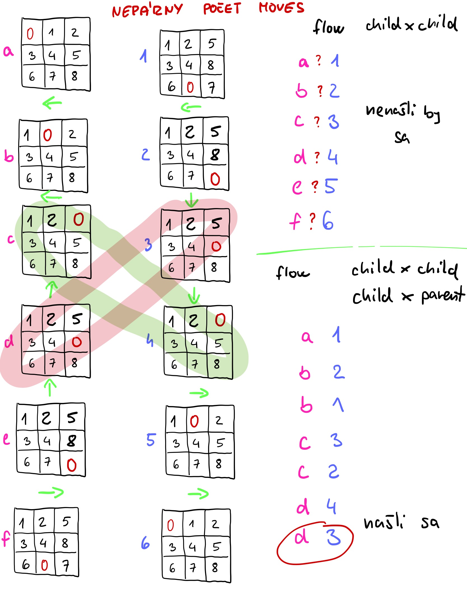
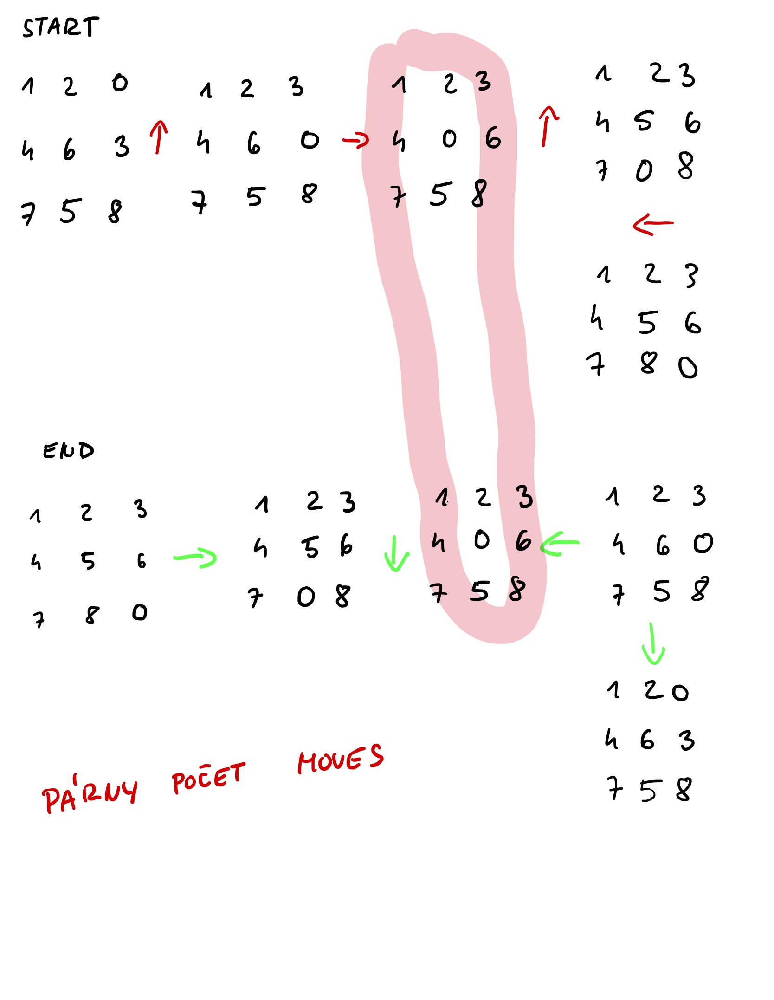

# UI Zadanie 1 c
## Prehľadávanie stavového priestoru, 8-Hlavolam, Obojstranny Algoritmus
### Viktória Bukovská FIIT STU UI 2023

Mojou ulohou je najst riesenie pre 8-Hlavolam. Pouzivatel zada vstupny a vystupny stav hlavolamu a moj program ma najst postupnost posunov ako sa dostat zo vstupneho stavu do vystupneho. Moj program je schopny hladat riesenia pre akukolvek velkost hlavolamu, samozrejme zmysel to dava az od 2*2. Hlavolam nemusi byt stvorcovy. 
[Link na Originalne Zadanie](http://www2.fiit.stuba.sk/~kapustik/z2d.html#C)

> ## How To: Spustenie a Pouzivanie programu
> Tento program bol napisany v programovaciom jazyku C#. Da sa spustit jeho [.exe](bin/Debug/net7.0/UI_Zadanie1_c_Bukovska.exe) Pozor, ak sa spusta cez .exe musi sa nachadzat v directori aj s ostatnymi subormi z [Debug/net7.0](bin/Debug/net7.0/) alebo spustit vo [Visual Studio 2022](https://visualstudio.microsoft.com/), ktore je dostupne aj pre Mac. Ak chcete otvorit tento projekt vo VS2022, staci mat nainstalovany VS2022 a stlacit na subor [.sln](UI_Zadanie1_c_Bukovska.sln) a VS2022 sa automaticky otvori nastavene s tymto projektom.
> V [Program.cs](Program.cs) sa nachadza main funkcia, kde sa da zmenit path k vstupnemu a vystupnemu suboru a maximalny pocet iteracii programu.
> Automaticky su obe paths nastavene na `input.txt` a `output.txt`. Tieto dva subory sa na ukazku tiez nachadzaju v [Debug/net7.0](bin/Debug/net7.0/),
>  teda [input file](bin/Debug/net7.0/input.txt) a [output file](bin/Debug/net7.0/output.txt).
> Pre spravne fungovanie programu subor `input.txt` alebo subor definovany v path v main musi existovat a mat spravnu syntax.
> ### Ukazka `Input.txt`
>```
>3*4
>1 2 3 4 5 6 7 8 9 10 11 0
>1 2 3 4 5 10 6 7 9 0 11 8
>```
> Na prvom riadku sa musia nachadzat dve cisla oddelene `*`. Prve cislo je pocet riadkov a druhe pocet stlpcov.
> Na druhom riadku sa nachadza po riadkoch obsah zaciatocneho stavu hlavolamu. Cisla musia byt oddelene ` ` teda medzerou. Pre spravne fungovanie programu sa tu musi nachadzat spravny pocet cisiel.
> Na tretom riadku su cisla finalneho stavu hlavolamu, ku ktoremu sa chcete dostat zo zaciatocneho stavu. Cislo `0` znazornuje medzeru.
> ### Ukazka `Output.txt`
> ```
> Down, Right, Right, Up, Left
> ```
> ```
> After 20 steps, the program still hasn't found the right steps
> ```
> ```
> No moves needed
> ```
> Vystup je bud postupnost spravnych pohybov alebo vypis, ze po x krokoch (podla toho ako to je v maine nastavene) program cestu nenasiel. Moznost je aj ze zaciatocny a konecny stav sa rovnaju. Pre niektore vstupy neexistuje postupnost spravnych krokov.
> ### Vysvetlenie pohybu
> `Down` znamena posun cisla nad medzerou smerom dole.
> `Up` znamena posun cisla pod medzerou smerom hore.
> `Left` znamena posun cisla napravo od medzery do lava.
> `Right` znamena posun cisla nalavo od medzery do prava.

## Obsah
- [Popis a vysvetlenie kodu](#Popis-a-vysvetlenie-kodu)
  - [Funkcia Main](#funkcia-main)
  - [Funckia Run()](#run)
  - [Funckia GetInputFromTXT()](#GetInputFromTXT)
  - [Funckia ReturnFoundResult()](#ReturnFoundResult)
  - [class PuzzleNode jej premenne a konstruktory](#PuzzleNode)
  - [Metoda PuzzleNode GetPossibleMoves()](#GetPossibleMoves)
  - [Metoda PuzzleNode GetNewState()](#GetNewState)
  - [Metoda PuzzleNode IsEqualState()](#IsEqualState)
  - [MoveEnum](#MoveEnum)
- [Algoritmus Obojsmerneho Hladania](#Algoritmus-Obojsmerneho-hladania)
- [Priklady a Testovanie](#Priklady-a-Testovanie)

## Popis a vysvetlenie kodu
### Funkcia Main
Funckia main sa nachadza v [Program.cs](Program.cs), kde sa v try catch spustí statická metóda [Run](#run) statickej classy [AppFlow](AppFlow.cs). Try catch využívam na zachytenie prípadných výnimiek a chýb a ich vypísanie do konzoly.
```C#
static void Main(string[] args)
  {
      try
      {
          int maxSteps = 10;
          AppFlow.Run("input.txt", "output.txt", maxSteps);
      }
      catch (Exception e)
      {
          Console.WriteLine("An error occurred;  " + e.Message);
      }
      
  }
```
`int maxSteps` je počet maximálne povolených iterácií. Pri čísle maxSteps = 10 sa vykoná 20 posunov, 10 spredu a 10 zozadu.

### Run
Tato staticka metoda sa nachadza v [AppFlow.cs](AppFlow.cs) a vola v [Maine](#funkcia-main). Prijma 3 parametre, path k vstupnemu a vystupnemu suboru a počet maximálne povolených iterácií. Pri čísle maxSteps = 10 sa vykoná 20 posunov, 10 spredu a 10 zozadu.
```C#
public static void Run(string inputFile, string outputFile, int maxSteps){}
```
Z metody [GetInputFromTXT](#GetInputFromTXT) ziskam instancie zaciatocnej a finalnej classy [PuzzleNode](#PuzzleNode).
```C#
var (startingNode, finalNode) = GetInputFromTXT(inputFile);
```
V tejto casti kodu volam metodu [IsEqualState](#IsEqualState) classy [PuzzleNode](#PuzzleNode). Ak vrati true to znamena, ze zaciatocny a konecny stav sa rovnaju, takze netreba ziaden posun a program moze skoncit. Teda zisti, ci vystupny subor existuje, ak hej ho vymaze a nasledne vytvori a zapise.
```C#
if (startingNode.IsEqualState(finalNode))
  {
      if (File.Exists(outputFile))
          File.Delete(outputFile);
      using (StreamWriter writer = new StreamWriter(outputFile))
      {
          writer.WriteLine("No moves needed");
      }
  }
```
Vytvorim si 4 variables pre Datovu strukturu [List<data type>](https://learn.microsoft.com/en-us/dotnet/api/system.collections.generic.list-1?view=net-7.0) pre classu [PuzzleNode](#PuzzleNode). Budem prehladavat od zaciatku a od konca. Pre kazde prehladvanie budem mat dva Listy, listy rodicov a listy deti. Na zaciatku si do rodicov pridam zaciatocnu a konecnu [PuzzleNode](#PuzzleNode).
```C#
List<PuzzleNode> parentsFromStart = new List<PuzzleNode>();
List<PuzzleNode> childrenfromStart = new List<PuzzleNode>();

List<PuzzleNode> parentsFromEnd = new List<PuzzleNode>();
List<PuzzleNode> childrenfromEnd = new List<PuzzleNode>();

parentsFromStart.Add(startingNode);
parentsFromEnd.Add(finalNode);
```
Dalsia cela cast sa nachadza v tomto for loope, ktory sluzi nato aby program sa nezacyklil a nebezal do nekonecna, kedze niekedy neexistuje spravna postupnost krokov. 
```C#
for (int i = 0; i < maxSteps; i++)
```
V prvej casti loopu si pre kazdeho rodica nachadzajuceho sa v liste pre rodicov (zo zaciatku aj z konca) zavolam funkciu [GetPossibleMoves](#GetPossibleMoves) ktora mi vrati list class [MoveEnum](#MoveEnum). Toto je vlastne list vsetkych moznych pohybov pre danu [PuzzleNode](#PuzzleNode). Pre kazdy mozny pohyb v tom liste pridam novu [PuzzleNode](#PuzzleNode) dietata do listu deti vdaka funkcii [GetNewState](#GetNewState), ktora sa zavola na aktualnu instanciu parenta a vrati novo vytvorenu instanciu stavu po danom pohybe. Toto sa stane pre rodicov zo zaciatku aj z konca.
```C#
foreach (PuzzleNode node in parentsFromStart)
{
    List<MoveEnum> possibleMoves = node.GetPossibleMoves();
    foreach (MoveEnum move in possibleMoves)
    {
        childrenfromStart.Add(node.GetNewState(move));
    }
}

foreach (PuzzleNode node in parentsFromEnd)
{
    List<MoveEnum> possibleMoves = node.GetPossibleMoves();
    foreach (MoveEnum move in possibleMoves)
    {
        childrenfromEnd.Add(node.GetNewState(move));
    }
}
```
V tejto casti for loopu idem porovnavat [PuzzleNodes](#PuzzleNode) medzi sebou. Pre kazdu Nodu dietata zo zaciatku zavolam kazdu Nodu dietata z konca a pomocou funkcie [IsEqualState](#IsEqualState) zistim, ci sa ich stavy rovnaju. Ak sa ich stavy rovnaju zavolam funkciu [ReturnFoundResult](#ReturnFoundResult) a tuto ukoncim. Ak sa ich stavy nerovnaju tento loop pokracuje a porovnava Nody parentov zo zadu s kazdou Nodou dietata zo zaciatku. Dovod preco musim porovnavat aj deti s parentami je vysvetleny na obrazku pod ukazkou kodu.
```C#
foreach (PuzzleNode nodeA in childrenfromStart)
{
    foreach (PuzzleNode nodeB in childrenfromEnd)
    {
        if (nodeA.IsEqualState(nodeB))
        {
            ReturnFoundResult(nodeA, nodeB, outputFile);
            return;
        }
    }
    foreach (PuzzleNode nodeC in parentsFromEnd)
    {
        if (nodeA.IsEqualState(nodeC))
        {
            ReturnFoundResult(nodeA, nodeC, outputFile);
            return;
        }
    }
}
```
Obrazok pre vysvetlenie preco treba deti porovnavat aj s rodicmi. Ak sa rovna stav dietata a rodica bude neparny pocet posunov.

Obrazok pre parny pocet posunov, teda pripad, ze rovnaky stav sa najde medzi detmi.

V poslednej casti for loopu vymazem vsetkych rodicov. Do rodicov zo zaciatku vlozim deti zo zaciatku a do rodicov z konca vlozim deti z konca. Potom vymazem Listy deti.
```C#
  parentsFromStart.Clear();
  parentsFromEnd.Clear();
  parentsFromStart = new List<PuzzleNode>(childrenfromStart);
  parentsFromEnd = new List<PuzzleNode>(childrenfromEnd);
  childrenfromStart.Clear();
  childrenfromEnd.Clear();
}
```
Po ukonceni for loopu, ak teda funkcia sa neukoncila skorej returnom a zavolanim funkcie [ReturnFoundResult](#ReturnFoundResult), prejde program az sem, kde po maximalonom pocte iteracii nenasiel spravny postup posunov, tak zisti ci existuje vystupny subor, ak hej vymaze ho a nasledne vytvori na novo a zapise, ze ani po tolko pohyboch sa nenasla postupnost.
```C#
if (File.Exists(outputFile))
    File.Delete(outputFile);
using (StreamWriter writer = new StreamWriter(outputFile))
{
    writer.WriteLine($"After {2*maxSteps} steps, the program still hasn't found the right steps");
}
```

### GetInputFromTXT
Metoda nachadzajuca sa v [AppFlow.cs](AppFlow.cs) prijma path k vstupnemu suboru a vracia dve instancie [PuzzleNodes](#PuzzleNode).
```C#
public static (PuzzleNode, PuzzleNode) GetInputFromTXT(string inputFile){}
```
do arrayu stringov lines precitam zo vstupneho filu vsetky riadky. Do premennej arrayu stringov dimensions si ulozim prvy riadok, ktory rozseknem podla znaku `*`, takze vlastne na indexe 0 sa nachadza pocet riadkov a na indexe 1 pocet stlpcov. (Ak mal vstupny subor spravny format). Nasledne si ich zmenim zo stringu na cisla. Do arrayu stringov startString a finalString si rozsekam druhy a treti riadok podla medzier. Inicializujem si dva 2D arraye intov, pre zaciatocny a konecny stav.
```C#
string[] lines = File.ReadAllLines(inputFile);

string[] dimensions = lines[0].Split('*');
int rows = int.Parse(dimensions[0]);
int columns = int.Parse(dimensions[1]);

string[] startString = lines[1].Split(' ');
string[] finalString = lines[2].Split(' ');

int[,] start = new int[rows, columns];
int[,] final = new int[rows, columns];
```
Vo for loope pre kazdy riadok zavolam for loop pre kazdy stlpec a do premennych 2D arrayov vlozim dane cisla. Nasledne vratim dve nove vytvorene instancie [PuzzleNodes](#PuzzleNode).
```C#
int startIndex = 0;
int finalIndex = 0;

for (int i = 0; i < rows; i++)
{
    for (int j = 0; j < columns; j++)
    {
        start[i, j] = int.Parse(startString[startIndex]);
        final[i, j] = int.Parse(finalString[finalIndex]);
        startIndex++;
        finalIndex++;
    }
}

return (new PuzzleNode(start, rows, columns), new PuzzleNode(final, rows, columns));
```
### PuzzleNode
Je classa nachadzajuca sa v [PuzzleNode.cs](PuzzleNode.cs). Tuto classu vyuzivam na ukladanie stavu. Obsahuje premenne Riadky, Stlpce, 2D array co predstavuje stav, List posunov [MoveEnum](#MoveEnum), ktore viedli az k tomuto stavu a array na ukladanie pozicie medzery.
```C#
public class PuzzleNode
{
    public int Rows { get; private set; }
    public int Columns { get; private set; }
    public int[,] State { get; set; }
    public List<MoveEnum> Moves { get; set; }
    public int[] SpacePosition { get; set; }
```
Tato classa ma 2 rozne Konstruktory a 3 rozne metody, [GetPossibleMoves](#GetPossibleMoves) a [GetNewState](#GetNewState) a [IsEqualState](#IsEqualState).
Prvy konstruktor prijma 2D array ako ukazku stavu, pocet riadkov a pocet stlpcov. Instancne premenne inicializuje a vlozi do nich prijate data.
```C#
public PuzzleNode(int[,] state, int rows, int columns)
{
    State = new int[rows, columns];
    Rows = rows;
    Columns = columns;
    SpacePosition = new int[2];

    for (int i = 0; i < rows; i++)
    {
        for (int j = 0; j < columns; j++)
        {
            State[i, j] = state[i, j];

            if (state[i, j] == 0)
            {
                SpacePosition[0] = i;
                SpacePosition[1] = j;
            }
        }
    }

    Moves = new List<MoveEnum>();
}
```
Druhy konstruktor je velmi podobny ale navyse prijma aj array pozicie medzery a List posunov [MoveEnum](#MoveEnum). Instancne premenne inicializuje a vlozi do nich prijate data.
```C#
public PuzzleNode(int[,] state, int rows, int columns, int[] spacePosition, List<MoveEnum> moves)
        {
            State = new int[rows, columns];
            Rows = rows;
            Columns = columns;
        
            for (int i = 0; i < rows; i++)
            {
                for (int j = 0; j < columns; j++)
                {
                    State[i, j] = state[i, j];
                }
            }

            SpacePosition = spacePosition.ToArray();

            Moves = new List<MoveEnum>(moves);
        }
```

### MoveEnum
Je enum na vyjadrenie moznych posunov. Nachadza sa v [MoveEnum.cs](MoveEnum.cs) `Down` znamena posun cisla nad medzerou smerom dole. `Up` znamena posun cisla pod medzerou smerom hore. `Left` znamena posun cisla napravo od medzery do lava. `Right` znamena posun cisla nalavo od medzery do prava. `Possible` je specialny pripad, ktory vyuzivam iba v metode [GetPossibleMoves](#GetPossibleMoves), kde aj vysvetlim preco.
```C#
public enum MoveEnum
{
    Up,
    Down,
    Left,
    Right,
    Possible
}
```

### ReturnFoundResult
Je funkcia nachadzajuca sa v [AppFlow.cs](AppFlow.cs). Prijma dve instancie Nodov a path k vystupnemu suboru. Tieto dva Nodu maju zhodu stavov, jeden je zo zaciatku a jeden z konca.
```C#
public static void ReturnFoundResult(PuzzleNode a, PuzzleNode b, string outputFile)
```
Ako prve premennu instancie zo zadu [PuzzleNode.cs](PuzzleNode.cs), Moves, co je vlasne List [MoveEnum](#MoveEnum) celu reversnem, teda otocim naopak. Pre kazdy posun v tom liste, podla toho ci je to up/down/left/right vlastne otocim zkonca. Kedze ak hladame cestu z oboch stran, tak zozadu sa posuvame presne naopak ako spredu. Takze ak spredu ideme dole tak zozadu ideme hore, ak spredu ideme dolava tak zozadu ideme doprava. Toto otocenie bolo mozne vidiet aj v obrazku pri funkcii [Run](#run). Vlastne teda otocenie pohybu pridam do Listu z Nody zo zaciatku. Do premennej stringu si pomocou `, ` dokopy vlozim a premennim na text kazdy posun. Na konci zistim ci vystupny subor existuje, ak hej ho vymazem a potom ho nanovo vytvorim a zapisem do nho vystupnu postupnost posunov.
```C#
b.Moves.Reverse();
foreach (MoveEnum move in b.Moves)
{
    switch (move)
    {
        case MoveEnum.Up:
            a.Moves.Add(MoveEnum.Down);
            break;
        case MoveEnum.Down:
            a.Moves.Add(MoveEnum.Up);
            break;
        case MoveEnum.Left:
            a.Moves.Add(MoveEnum.Right);
            break;
        case MoveEnum.Right:
            a.Moves.Add(MoveEnum.Left);
            break;
        default:
            break;
    }
}

string result = string.Join(", ", a.Moves.Select(m => m.ToString()));

if (File.Exists(outputFile))
    File.Delete(outputFile);
using (StreamWriter writer = new StreamWriter(outputFile))
{
    writer.WriteLine(result);
}
```
### GetPossibleMoves
Je metoda classy [PuzzleNode](#PuzzleNode), ktora sa nachadza v [PuzzleNode.cs](PuzzleNode.cs). Vracia List [MoveEnumov](#MoveEnum). Na zaciatku incializuje novy prazdny list posunov a vytvori premennu lastMove, ktora sluzi nato aby sa program zbytocne neopakoval, teda ak posledny krok bol smerom hore, tak dalsi krok nebude smerom dole, lebo by sa vratil do rovnakeho stavu ako predtym. Toto je sice jednoducha ale velmi ucinna optimalizacia. Problem nastava, ze ak List posunov je este prazdny, nemame s cim porovnavat, teda chceme pridat kazdu moznost pohybu. Preto som vytvorila specialny pripad [MoveEnumu](#MoveEnum) Possible. Potom cez if do toho listu postupne pridava moznosti pohybov. Ak vedla medzery napravo sa nachadza nejake cislo (teda neni tam okraj puzzle), tak je mozne sa posunut dolava. Ak vedla medzery nalavo sa nachadza cislo, da sa posunut doprava. Ak sa pod medzerou nachadza nejake cislo, je mozne sa posunut hore a ak sa nad medzerou nachadza cislo, je mozne posunut sa dole. Nasledne tento List vratim.
```C#
public List<MoveEnum> GetPossibleMoves()
{
    List<MoveEnum> possibleMoves = new List<MoveEnum>();
    MoveEnum lastMove;
    if (Moves.Count != 0)
        lastMove = Moves.Last();
    else
        lastMove = MoveEnum.Possible;

    // left
    if ((SpacePosition[1] + 1 < Columns) && (lastMove != MoveEnum.Right))
        possibleMoves.Add(MoveEnum.Left);
    // right
    if ((SpacePosition[1] - 1 >= 0) && (lastMove != MoveEnum.Left))
        possibleMoves.Add(MoveEnum.Right);
    //up
    if ((SpacePosition[0] + 1 < Rows) && (lastMove != MoveEnum.Down))
        possibleMoves.Add(MoveEnum.Up);
    //down
    if ((SpacePosition[0] - 1 >= 0) && (lastMove != MoveEnum.Up))
        possibleMoves.Add(MoveEnum.Down);

    return possibleMoves;
}
```

### GetNewState
Je metoda classy [PuzzleNode](#PuzzleNode), ktora sa nachadza v [PuzzleNode.cs](PuzzleNode.cs). Vracia instanciu novej [PuzzleNode](#PuzzleNode) a ako parameter prijma posun [MoveEnum](#MoveEnum). Ako prve si inicializujem novy 2D array a nakopirujem tam stav z tejto instancie. Inicializujem si dva inty na nezmyselne cisla aby som ich mohla pouzivat.
```C#
public PuzzleNode GetNewState(MoveEnum move)
{
    int[,] newState = new int[Rows,Columns];
    for (int i = 0; i < Rows; i++)
    {
        for (int j = 0; j < Columns; j++)
        {
            newState[i, j] = State[i, j];
        }
    }

    int tomoveX = -1;
    int tomoveY = -1;
```
Podla toho aky posun [MoveEnum](#MoveEnum) do metody prisiel, zmenim tieto dva inty, ktore budem pouzivat ako indexy v 2D arrayi. Ak sa chceme posunut hore musime vymenit poziciu medzere s poziciou cisla po nou. Takto pre kazdy posun si zapamatame novy index medzery a nasledne v tom inicializovanom 2D arrayi uz zmenime dane pozicie na spravnu hodnotu, teda medzera a cislo uz budu vymenene. Potom si do arrayu ulozim novu poziciu medzery, vytvorim novy list [MoveEnumov](#MoveEnum), do ktoreho vlozim vsetky posuny z tejto aktualnej [PuzzleNode](#PuzzleNode) a pridam do nho este aj novy posun, ktory mi bol poslany. Tymito datami vytvorim novu [PuzzleNode](#PuzzleNode) a vratim ju.
```C#
  switch (move) 
  {
      case MoveEnum.Up:
          tomoveX = SpacePosition[0] + 1;
          tomoveY = SpacePosition[1];
          break;
      case MoveEnum.Down:
          tomoveX = SpacePosition[0] - 1;
          tomoveY = SpacePosition[1];
          break;
      case MoveEnum.Left:
          tomoveX = SpacePosition[0];
          tomoveY = SpacePosition[1] + 1;
          break;
      case MoveEnum.Right:
          tomoveX = SpacePosition[0];
          tomoveY = SpacePosition[1] - 1;
          break;
  }

  newState[SpacePosition[0], SpacePosition[1]] = State[tomoveX, tomoveY];
  newState[tomoveX, tomoveY] = State[SpacePosition[0], SpacePosition[1]];

  int[] spacePosition = new int[2];
  spacePosition[0] = tomoveX;
  spacePosition[1] = tomoveY;

  List<MoveEnum> newMoves = new List<MoveEnum>(Moves);
  newMoves.Add(move);

  return new PuzzleNode(newState, Rows, Columns, spacePosition, newMoves);
}
```

### IsEqualState
Je metoda classy [PuzzleNode](#PuzzleNode), ktora sa nachadza v [PuzzleNode.cs](PuzzleNode.cs). Prijma instanciu inej [PuzzleNode](#PuzzleNode) a vracia boolean teda true alebo false. Vo dvojitom for loope, ktory porovnava arraye teda stavy tychto dvoch [PuzzleNodeov](#PuzzleNode) a vrati false, ak sa nejaka pozicia nerovna. Ak prejde vsetky pozicia a nerovnost sa nenasla, vrati true, co znamena, ze stavy sa rovnaju.
```C#
public bool IsEqualState(PuzzleNode other)
{
    for (int i = 0; i < Rows; i++)
    {
        for (int j = 0; j < Columns; j++)
        {
            if (State[i, j] != other.State[i, j])
                return false;
        }
    }

    return true;
}
```

## Algoritmus Obojsmerneho hladania
### Vseobecny opis
Tento Algoritmus sa snazi najst cestu z jedneho uzla do druheho uzla tak, ze naraz prehladava cestu z oboch stran. Cestu nasiel ked sa tieto dva uzle stretnu v strede. Kedze naraz prehladava z oboch stran, ide vzdy postupne podla prehladavania do sirky, level po leveli, aby vedel najst, co najkrajtsiu cestu. Prehladavanie do sirky funguje tak, ze pre aktualny uzol najdeme vsetky susedne uzly vzdialene dlzky 1. A az potom sa posunieme na dalsi uzol.
### Ako som postupovala ja
Kedze som si nepotrebovala uchovavat vsetky Uzle, vzdy som si len pamatala postupnost posunov, ktorymi som sa k tomuto uzlu dostala. Vdaka tomu som setrila viac pamat programu. Dalsiou optimalizaciou bolo zakazat sa vratit spat na rovnaky stav uzla. Ak posledny posun bol dole, tak dalsi nemoze byt hore, inac by sme sa vratili na ten isty stav. Taktiez si bolo treba uvedomit, ze pri 8-Hlavolame vzdy nastane posun a zmena stavu, takze ak sme prehladavali z oboch stran, mohla nastat situacia, ze sa stavy vzdy o jeden posun preskocia. Taketo preskocenie nastava ak vysledny pocet posunov je neparny. Vlastnorucne kreslene vysvetlenie som pridala ako dva obrazky v dir obrazky teda [obrazky](/obrazky/).


### Pamat
Maximalne zabratie pamate nastava, ak je mozne vykonat vsetky 4 smery posunov, teda musi vzniknut z jedneho uzla dalsie 4. To znamena ze pri najhorsiom, pripade, co je teda nemozne, lebo nikdy nebude medzera stale v strede by sa pocet zvacsoval 1->4->16->64 .. Ale kedze vzdy zakazem rovnaky pohyb tak to mozem obmedzit na maximalne 3 dalsie rovnake uzly, teda by to slo, ze 1->4->12->36 .. 
### Vyhody a Nevyhody
Pre 8-Puzzle 8 Hlavolam je obojsmerne prehladavanie celkom dobra volba, pretoze najde urcite najkratsiu cestu ako prvu. Taktiez je to rychlejsie ako hladanie iba z jedneho smeru, lebo by sme nevedeli, ci najdena cesta je optialna a trvalo by to viac casu. Nevyhodou je ze obojsmerne prehladavanie potrebuje viac pamate nez prehladavanie z jednej strany. 

## Priklady a Testovanie
Chcela by som vam odporucit na vizualne zobrazovanie stranku [https://tilesolver.com/](https://tilesolver.com/). Riesenie cesty tejto stranky je velmi casto dlhsie nez to moje a to preto, ze pouziva iny algoritmus. No ak testujeme pre velkost 3*3 da sa tam lahko posuny simulovat. Pouzivam priklady zo zadania.

> ### Ako testujem
> Testujem na Windows 10 s procesorom Intel(R) Core(TM) i7-10870H CPU @ 2.20 GHz 2.21 GHz s 16 GB RAM v IDE Visual Studio 2022 v jazyku C#
> do classy PuzzleNode som pridala `public static int pocet = 0;` a inkrementujem ho pri kazdom zavolani konstruktora.
> Do mainu som pridala
> ```C#
> Stopwatch stopwatch = new Stopwatch();
> int maxSteps = 15;
> stopwatch.Start();
> AppFlow.Run("input.txt", "output.txt", maxSteps);
> stopwatch.Stop();
> long elapsedMilliseconds = stopwatch.ElapsedMilliseconds;
> Console.WriteLine($"Elapsed Time: {elapsedMilliseconds} ms");
> Console.WriteLine(PuzzleNode.pocet);
> ```

### Priklad 1 2*3
int maxSteps = 15;  
Vstup
```
2*3
0 1 2 3 4 5
3 4 5 0 1 2
```
Vystup
```
Left, Left, Up, Right, Down, Right, Up, Left, Left, Down, Right, Up, Right, Down, Left, Left, Up, Right, Down, Right, Up
```
Pocet vytvorenych PuzzleNodeov : 368
Cas zbehnutia: Elapsed Time: 14 ms

### Priklad 2 4*2
int maxSteps = 20;  
Vstup
```
2*4
0 1 2 3 4 5 6 7
3 2 5 4 7 6 1 0
```
Vystup
```
Left, Left, Left, Up, Right, Right, Right, Down, Left, Left, Left, Up, Right, Right, Down, Left, Left, Up, Right, Right, Right, Down, Left, Up, Left, Down, Right, Up, Right, Down, Left, Up, Left, Down, Left, Up
```
Pocet vytvorenych PuzzleNodeov : 22136
Cas zbehnutia: Elapsed Time: 583 ms

### Priklad 3 3*3
int maxSteps = 25;  
Vstup
```
3*3
0 1 2 3 4 5 6 7 8
8 0 6 5 4 7 2 3 1
```
Vystup
```
Left, Left, Up, Right, Right, Down, Left, Left, Up, Up, Right, Right, Down, Left, Up, Right, Down, Down, Left, Up, Left, Down, Right, Up, Left, Up, Right, Right, Down, Down, Left
```
Pocet vytvorenych PuzzleNodeov : 49960
Elapsed Time: 2695 ms

### Priklad 4 3*3
int maxSteps = 25;  
Vstup
```
3*3
1 2 3 4 5 6 7 8 0
2 5 8 6 4 1 3 7 0
```
Vystup
```
Right, Right, Down, Left, Left, Up, Right, Down, Down, Right, Up, Left, Down, Left, Up, Right, Down, Right, Up, Up, Left, Down, Right, Up, Left, Left
```
Pocet vytvorenych PuzzleNodeov : 8742
Elapsed Time: 131 ms

## Zaver
Na riesenie tejto ulohy bol algoritmus obojstranneho prehladavania vhodny vyber. No ak chceme riesit aj vacsie hlavolami, s postupom krokov vacsim ako napr 40 posunov, tento algoritmus kym vobec dojde nato, ze ani dany pocet krokov mu nestaci, trva strasne dlho. Viem si predstavit do buducna este vylepsit optimalizaciu cyklenia, kedze aktualne moj program zakazuje sa vracat na predchadzajuci stav, ale mozno by bolo nejak mozne mu zakazat robit cykly, cim berie viac pamate.
